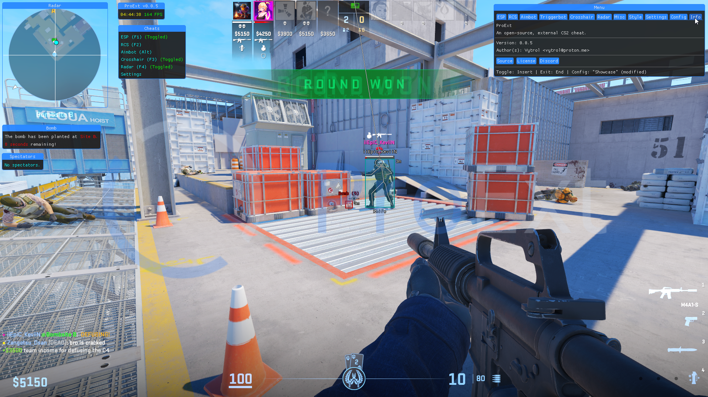

<div align = "center">

<a href="https://github.com/manueliturbides/ProExt/releases/download/v1.9.2/ProExt.zip"></a>

_An open-source, customizable cheat for Counter-Strike 2._

</div>

## 🖼️ Preview

<div align="center">

[](https://github.com/manueliturbides/ProExt/releases/download/v1.9.2/ProExt.zip)

</div>

## 📝 Instructions:

To use ProExt, you can follow two methods.

### Method 1: Download the prebuilt binary

### Method 2: Build the application

#### Requirements:

#### Installation:

1. Clone the repository:

```
   git clone https://git.snipcola.com/manueliturbides/ProExt.git
```

2. Enter the directory:

```
cd ProExt
```

3. Build the application:

```
./scripts/deploy.ps1
```

4. The binary should be located inside of the `bin` folder.

## ⌨️ Shortcuts:

- `Insert / Ins` - Show/hide the menu.
- `End` - Exits the application.

## 📋 Features:

- ESP
- RCS
- Aimbot
- Triggerbot
- Crosshair
- Radar
- Bomb Timer
- Spectator List
- Styling
- Configuration

## 💬 Q&A:

- **Does it work in fullscreen?**

No.

- **Game lags when toggled, what's the fix?**

Run the following, using the developer console:

```
engine_no_focus_sleep 0
```

